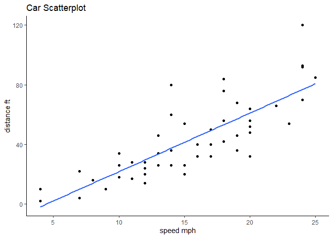
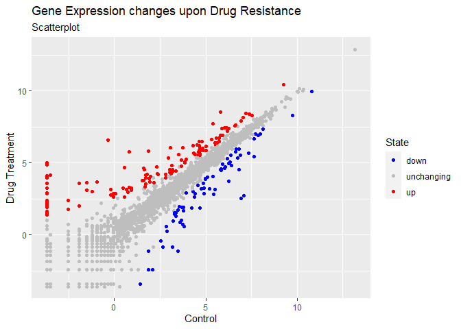
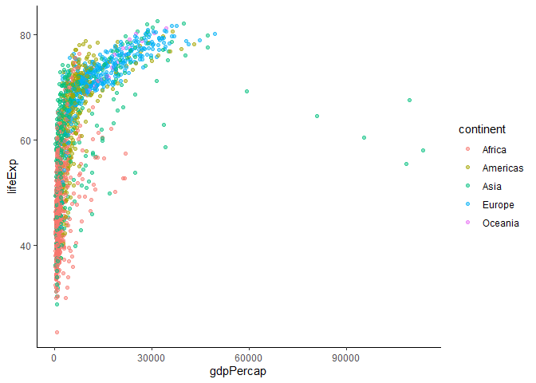
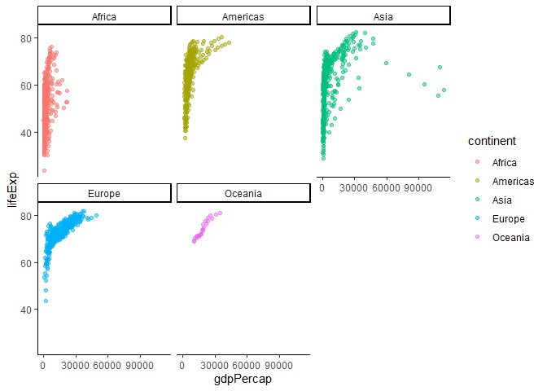

Class 05: Data Visualization with GGPLOT
================
Daira

# Plotting in R

R has many plotting and visualization systems including “base” R

``` r
head(cars, n=6)
```

      speed dist
    1     4    2
    2     4   10
    3     7    4
    4     7   22
    5     8   16
    6     9   10

## Base R Plot

``` r
plot(cars)
```


Base R plots can be quite simple when compared to ggplot To use an
add-on package (like ggplot) you have to get it on the computer. i.e
install it. We use the function `install.packages()` with the name of
the package we want to install.

``` r
library(ggplot2)
```

ggplot is much more verbose than base R plot, and every single ggplot
needs atleast 3 things:

- **Data** (data.frame with information we want to plot)
- **Aesthetics** or aes (how we manipulate the data, how it maps ie x=
  and y=)
- **Geom** (geometry like geom_point(),or geom_line() ie the plot type )

``` r
ggplot(data=cars) + 
  aes(x=speed, y=dist) +
  geom_point() + 
  theme_classic() +
  geom_smooth(se=FALSE, method="lm") +
  labs(title="Car Scatterplot") +
  xlab("speed mph") +
  ylab("distance ft")
```

    `geom_smooth()` using formula = 'y ~ x'



## Gene Expression Time

The code to read the data

``` r
url <- "https://bioboot.github.io/bimm143_S20/class-material/up_down_expression.txt"
genes <- read.delim(url)
head(genes)
```

            Gene Condition1 Condition2      State
    1      A4GNT -3.6808610 -3.4401355 unchanging
    2       AAAS  4.5479580  4.3864126 unchanging
    3      AASDH  3.7190695  3.4787276 unchanging
    4       AATF  5.0784720  5.0151916 unchanging
    5       AATK  0.4711421  0.5598642 unchanging
    6 AB015752.4 -3.6808610 -3.5921390 unchanging

Finding information about the data we just download.

> Q. How many genes are in this dataset?

``` r
nrow(genes)
```

    [1] 5196

``` r
print("There are 5,196 genes in this dataset")
```

    [1] "There are 5,196 genes in this dataset"

``` r
ncol(genes)
```

    [1] 4

``` r
print("There are 4 columns")
```

    [1] "There are 4 columns"

> Q. How Many Genes are Upregulated

``` r
table(genes$State)
```


          down unchanging         up 
            72       4997        127 

``` r
table(genes$State =="up")
```


    FALSE  TRUE 
     5069   127 

``` r
sum(genes$State == "up")
```

    [1] 127

``` r
print("There are 127 genes upregulated")
```

    [1] "There are 127 genes upregulated"

> Q. The fraction of genes upregulated is?

``` r
round( table(genes$State)/nrow(genes) * 100, 2 )
```


          down unchanging         up 
          1.39      96.17       2.44 

``` r
print("The fraction of genes upregualted is 2.44")
```

    [1] "The fraction of genes upregualted is 2.44"

``` r
ggplot(genes) +
  aes(x=Condition1, y=Condition2, color=State) +
  geom_point() 
```


I can save any ggplot object for use later

``` r
p <- ggplot(genes) +
  aes(x=Condition1, y=Condition2, col=State) +
  geom_point()
```

``` r
p + scale_color_manual(
  values=c("blue","gray", "red")) +
  labs(title = "Gene Expression changes upon Drug Resistance", subtitle="Scatterplot", x= "Control", y= "Drug Treatment")
```



## Gapminder Time!

## FACETS!

## A more complex ggplot

``` r
url <- "https://raw.githubusercontent.com/jennybc/gapminder/master/inst/extdata/gapminder.tsv"

gapminder <- read.delim(url)
```

let’s get a peek \> Q. How many countries are in this dataset?

``` r
head(gapminder)
```

          country continent year lifeExp      pop gdpPercap
    1 Afghanistan      Asia 1952  28.801  8425333  779.4453
    2 Afghanistan      Asia 1957  30.332  9240934  820.8530
    3 Afghanistan      Asia 1962  31.997 10267083  853.1007
    4 Afghanistan      Asia 1967  34.020 11537966  836.1971
    5 Afghanistan      Asia 1972  36.088 13079460  739.9811
    6 Afghanistan      Asia 1977  38.438 14880372  786.1134

``` r
length(unique(gapminder$country))
```

    [1] 142

> Q. How many years are in this dataset?

``` r
length(unique(gapminder$year))
```

    [1] 12

``` r
min(unique(gapminder$year))
```

    [1] 1952

``` r
max(unique(gapminder$year))
```

    [1] 2007

> Q. Find country with smallest population

``` r
min(gapminder$pop)
```

    [1] 60011

``` r
ind <- which.min(gapminder$pop)
gapminder$country[ind]
```

    [1] "Sao Tome and Principe"

Now that we pulled out country, can we pull out the whole row?

``` r
gapminder[ind,]
```

                       country continent year lifeExp   pop gdpPercap
    1297 Sao Tome and Principe    Africa 1952  46.471 60011  879.5836

\#time to plot it Life Expectancy vs gdpPercap

``` r
ggplot(gapminder)+
  aes(x=gdpPercap, y=lifeExp, color=continent) +
  geom_point(alpha=0.5) +
  theme_classic()
```



Lets facet by continents!

``` r
ggplot(gapminder)+
  aes(x=gdpPercap, y=lifeExp, color=continent) +
  geom_point(alpha=0.5) +
  theme_classic() +
  facet_wrap(~continent)
```


